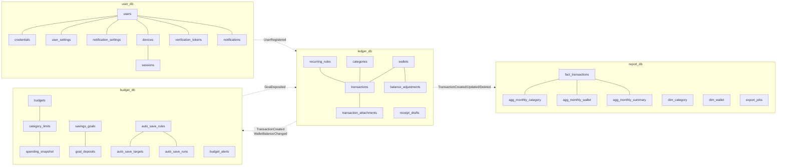

# Finance App — Thiết kế Database

> Tài liệu này là **nguồn sự thật duy nhất** cho schema của 4 database. Mỗi lần đổi bảng
> phải sửa file này **và** thêm một Flyway migration mới — không sửa migration đã chạy.

---

## Mục lục

1. [Nguyên tắc bắt buộc](#1-nguyên-tắc-bắt-buộc)
2. [Khởi tạo database](#2-khởi-tạo-database)
3. [Quy ước đặt tên & cột chung](#3-quy-ước-đặt-tên--cột-chung)
4. [Bản đồ tổng thể](#4-bản-đồ-tổng-thể)
5. [`user_db` — user-service](#5-user_db--user-service)
6. [`ledger_db` — ledger-service](#6-ledger_db--ledger-service)
7. [`budget_db` — budget-service](#7-budget_db--budget-service)
8. [`report_db` — report-service](#8-report_db--report-service)
9. [Hợp đồng event (RabbitMQ)](#9-hợp-đồng-event-rabbitmq)
10. [Bảng tra enum](#10-bảng-tra-enum)
11. [Dữ liệu mẫu (seed)](#11-dữ-liệu-mẫu-seed)
12. [Chiến lược index & hiệu năng](#12-chiến-lược-index--hiệu-năng)
13. [Checklist triển khai](#13-checklist-triển-khai)

---

## 1. Nguyên tắc bắt buộc

| # | Luật | Lý do |
|---|---|---|
| 1 | **Không có FOREIGN KEY xuyên database.** `user_id` trong `ledger_db` chỉ là UUID trần. | Ranh giới microservice. Muốn dữ liệu chéo → gọi API hoặc nghe event. |
| 2 | **Tiền lưu `BIGINT`, đơn vị đồng (VND, không phần lẻ).** Không bao giờ `float`/`double` cho tiền. | Frontend đã dùng `Long`. Giữ nguyên suốt stack. Ngoại tệ có phần lẻ → lưu **minor unit** (cent) + `currency_decimals`. |
| 3 | **Thời gian lưu `TIMESTAMPTZ`**, luôn UTC. Chỉ dùng `DATE` cho ngày nghiệp vụ thuần (ngày của kỳ ngân sách). | Người dùng đổi múi giờ, báo cáo tháng vẫn đúng. |
| 4 | **Khoá chính là `UUID`** (`gen_random_uuid()`), không dùng `BIGSERIAL`. | Client sinh id được → offline-first, idempotent retry, không lộ số lượng bản ghi. |
| 5 | **Flyway sở hữu schema.** `spring.jpa.hibernate.ddl-auto=validate`. | Hibernate không được tự sửa bảng. |
| 6 | **Xoá mềm (`deleted_at`) cho dữ liệu nghiệp vụ**, xoá cứng cho bảng kỹ thuật (token, session, event log). | Undo giao dịch, báo cáo cần lịch sử. |
| 7 | **Mọi bảng nghiệp vụ mang `user_id`** và **mọi query phải lọc theo `user_id`**. | Multi-tenant ở tầng hàng. Index composite luôn bắt đầu bằng `user_id`. |
| 8 | **`report_db` chỉ ghi bởi event consumer**, không bao giờ ghi trực tiếp từ API. | CQRS — đây là read model. |

---

## 2. Khởi tạo database

### 2.1 Chạy lần đầu

```bash
cd backend
cp .env.example .env
# JWT_SECRET >= 32 ký tự
openssl rand -base64 48

docker compose up -d postgres rabbitmq
docker compose logs -f postgres     # chờ "database system is ready to accept connections"
docker compose up --build
```

`infra/postgres/init-databases.sql` **chỉ chạy đúng một lần**, khi volume `postgres-data`
còn rỗng. Sửa file đó sau này sẽ không có tác dụng cho tới khi:

```bash
docker compose down -v      # XOÁ TOÀN BỘ DỮ LIỆU
docker compose up --build
```

### 2.2 Bổ sung cần thêm vào `infra/postgres/init-databases.sql`

File hiện tại đã tạo 4 role + 4 database và `REVOKE CONNECT ... FROM PUBLIC`. Còn thiếu
phần extension — extension phải tạo *trong từng database* bởi superuser:

```sql
-- Nối vào cuối infra/postgres/init-databases.sql
\connect user_db
CREATE EXTENSION IF NOT EXISTS pgcrypto;   -- gen_random_uuid()
CREATE EXTENSION IF NOT EXISTS citext;     -- email không phân biệt hoa thường

\connect ledger_db
CREATE EXTENSION IF NOT EXISTS pgcrypto;
CREATE EXTENSION IF NOT EXISTS unaccent;   -- tìm ghi chú tiếng Việt không dấu
CREATE EXTENSION IF NOT EXISTS pg_trgm;    -- ILIKE '%...%' trên note/merchant

\connect budget_db
CREATE EXTENSION IF NOT EXISTS pgcrypto;

\connect report_db
CREATE EXTENSION IF NOT EXISTS pgcrypto;
```

> Postgres 16 đã có `gen_random_uuid()` built-in; `pgcrypto` là để phòng khi hạ version.
> `citext` và `pg_trgm` thì bắt buộc phải `CREATE EXTENSION`.

### 2.3 Vị trí migration

```
backend/
├── user-service/src/main/resources/db/migration/
│   ├── V1__init_schema.sql
│   └── V2__seed_defaults.sql
├── ledger-service/src/main/resources/db/migration/
│   ├── V1__init_schema.sql
│   └── V2__seed_system_categories.sql
├── budget-service/src/main/resources/db/migration/
│   └── V1__init_schema.sql
└── report-service/src/main/resources/db/migration/
    └── V1__init_read_model.sql
```

Flyway tự chạy lúc service khởi động (`spring.flyway.enabled=true`).

### 2.4 Kiểm tra sau khi chạy

```bash
docker exec -it finance-postgres psql -U ledger_db -d ledger_db -c '\dt'
docker exec -it finance-postgres psql -U ledger_db -d ledger_db -c 'SELECT * FROM flyway_schema_history;'

# Xác nhận ranh giới bị chặn thật — lệnh này PHẢI lỗi "permission denied":
docker exec -it finance-postgres psql -U ledger_db -d user_db -c '\dt'
```

---

## 3. Quy ước đặt tên & cột chung

| Quy ước | Ví dụ |
|---|---|
| Bảng: `snake_case`, **số nhiều** | `transactions`, `savings_goals` |
| Cột: `snake_case` | `occurred_at`, `include_in_total` |
| Khoá ngoại: `<bảng_số_ít>_id` | `wallet_id`, `category_id` |
| Boolean: `is_` / `has_` / động từ quá khứ | `is_active`, `email_verified` |
| Thời điểm: `_at` (TIMESTAMPTZ) · Ngày: `_date` (DATE) | `created_at`, `target_date` |
| Tiền: `_amount` hoặc tên rõ nghĩa, luôn BIGINT | `target_amount`, `limit_amount` |
| Index: `idx_<bảng>_<cột>` · Unique: `uq_<bảng>_<cột>` | `idx_txn_user_occurred` |
| Enum: lưu **`VARCHAR` + `CHECK`**, KHÔNG dùng `CREATE TYPE ... AS ENUM` | dễ thêm giá trị mới, Hibernate map `@Enumerated(STRING)` gọn |

### Cột chung của mọi bảng nghiệp vụ

```sql
id          UUID        PRIMARY KEY DEFAULT gen_random_uuid(),
user_id     UUID        NOT NULL,                      -- không FK xuyên DB
created_at  TIMESTAMPTZ NOT NULL DEFAULT now(),
updated_at  TIMESTAMPTZ NOT NULL DEFAULT now(),
deleted_at  TIMESTAMPTZ                                -- NULL = còn sống
```

### Trigger tự cập nhật `updated_at`

Đặt ở đầu `V1__init_schema.sql` của **cả 4 service**:

```sql
CREATE OR REPLACE FUNCTION set_updated_at() RETURNS trigger AS $$
BEGIN
    NEW.updated_at = now();
    RETURN NEW;
END;
$$ LANGUAGE plpgsql;

-- Rồi với mỗi bảng có updated_at:
-- CREATE TRIGGER trg_<bảng>_updated BEFORE UPDATE ON <bảng>
--   FOR EACH ROW EXECUTE FUNCTION set_updated_at();
```

---

## 4. Bản đồ tổng thể



**Ai sở hữu cái gì**

| Khái niệm | DB sở hữu | Ai chỉ có bản sao (cache/projection) |
|---|---|---|
| `user` | `user_db` | không ai — các service chỉ giữ `user_id` |
| `wallet`, `transaction`, `category`, `recurring` | `ledger_db` | `budget_db` (tên danh mục), `report_db` (`dim_*`) |
| `budget`, `limit`, `goal`, `auto_save` | `budget_db` | — |
| read model báo cáo | `report_db` | — (được dựng từ event) |

---

## 5. `user_db` — user-service

Màn hình phục vụ: Login, Register 1–3, VerifyEmail, Account, Profile, Security,
CurrencySettings, NotificationSettings, Notifications, BackupSync, DeleteData.

### 5.1 `users`

| Cột | Kiểu | Null | Mặc định | Ghi chú |
|---|---|---|---|---|
| `id` | UUID | ✗ | `gen_random_uuid()` | PK — dùng làm `user_id` ở mọi service |
| `email` | CITEXT | ✗ | | UNIQUE, không phân biệt hoa thường |
| `email_verified` | BOOLEAN | ✗ | `false` | VerifyEmailScreen |
| `email_verified_at` | TIMESTAMPTZ | ✓ | | |
| `full_name` | VARCHAR(100) | ✗ | | "Nguyễn Minh" |
| `phone` | VARCHAR(20) | ✓ | | AccountScreen — "Chưa thêm" |
| `phone_verified` | BOOLEAN | ✗ | `false` | |
| `avatar_url` | TEXT | ✓ | | |
| `status` | VARCHAR(20) | ✗ | `'ACTIVE'` | `ACTIVE` `SUSPENDED` `PENDING_DELETION` |
| `plan` | VARCHAR(20) | ✗ | `'FREE'` | `FREE` `PLUS` — AccountScreen "Gói miễn phí" |
| `plan_expires_at` | TIMESTAMPTZ | ✓ | | |
| `locale` | VARCHAR(10) | ✗ | `'vi-VN'` | ProfileScreen → Ngôn ngữ |
| `timezone` | VARCHAR(50) | ✗ | `'Asia/Ho_Chi_Minh'` | Ranh giới ngày/tháng của báo cáo |
| `onboarding_completed` | BOOLEAN | ✗ | `false` | Register 3 bước xong chưa |
| `last_login_at` | TIMESTAMPTZ | ✓ | | |
| `created_at` / `updated_at` / `deleted_at` | TIMESTAMPTZ | | | chuẩn chung |

```sql
CREATE TABLE users (
    id                   UUID PRIMARY KEY DEFAULT gen_random_uuid(),
    email                CITEXT       NOT NULL,
    email_verified       BOOLEAN      NOT NULL DEFAULT false,
    email_verified_at    TIMESTAMPTZ,
    full_name            VARCHAR(100) NOT NULL,
    phone                VARCHAR(20),
    phone_verified       BOOLEAN      NOT NULL DEFAULT false,
    avatar_url           TEXT,
    status               VARCHAR(20)  NOT NULL DEFAULT 'ACTIVE',
    plan                 VARCHAR(20)  NOT NULL DEFAULT 'FREE',
    plan_expires_at      TIMESTAMPTZ,
    locale               VARCHAR(10)  NOT NULL DEFAULT 'vi-VN',
    timezone             VARCHAR(50)  NOT NULL DEFAULT 'Asia/Ho_Chi_Minh',
    onboarding_completed BOOLEAN      NOT NULL DEFAULT false,
    last_login_at        TIMESTAMPTZ,
    created_at           TIMESTAMPTZ  NOT NULL DEFAULT now(),
    updated_at           TIMESTAMPTZ  NOT NULL DEFAULT now(),
    deleted_at           TIMESTAMPTZ,
    CONSTRAINT ck_users_status CHECK (status IN ('ACTIVE','SUSPENDED','PENDING_DELETION')),
    CONSTRAINT ck_users_plan   CHECK (plan   IN ('FREE','PLUS'))
);
-- Email chỉ unique trong các tài khoản còn sống → xoá rồi đăng ký lại được
CREATE UNIQUE INDEX uq_users_email ON users (email) WHERE deleted_at IS NULL;
```

### 5.2 `credentials`

Tách khỏi `users` để `SELECT *` trên `users` không bao giờ kéo theo hash mật khẩu.

```sql
CREATE TABLE credentials (
    id                  UUID PRIMARY KEY DEFAULT gen_random_uuid(),
    user_id             UUID         NOT NULL REFERENCES users(id) ON DELETE CASCADE,
    password_hash       VARCHAR(255) NOT NULL,          -- BCrypt cost 10+
    algorithm           VARCHAR(20)  NOT NULL DEFAULT 'BCRYPT',
    password_changed_at TIMESTAMPTZ  NOT NULL DEFAULT now(),  -- Account: "Đổi lần cuối 3 tháng trước"
    failed_attempts     SMALLINT     NOT NULL DEFAULT 0,
    locked_until        TIMESTAMPTZ,                    -- chống brute-force
    created_at          TIMESTAMPTZ  NOT NULL DEFAULT now(),
    updated_at          TIMESTAMPTZ  NOT NULL DEFAULT now(),
    CONSTRAINT uq_credentials_user UNIQUE (user_id)
);
```

### 5.3 `verification_tokens`

Dùng chung cho xác thực email (mã 6 số) và quên mật khẩu.

```sql
CREATE TABLE verification_tokens (
    id           UUID PRIMARY KEY DEFAULT gen_random_uuid(),
    user_id      UUID         NOT NULL REFERENCES users(id) ON DELETE CASCADE,
    purpose      VARCHAR(30)  NOT NULL,   -- VERIFY_EMAIL | RESET_PASSWORD | CHANGE_EMAIL
    code_hash    VARCHAR(255) NOT NULL,   -- KHÔNG lưu mã thật
    destination  VARCHAR(255) NOT NULL,   -- email/sđt nhận mã
    attempts     SMALLINT     NOT NULL DEFAULT 0,
    max_attempts SMALLINT     NOT NULL DEFAULT 5,
    expires_at   TIMESTAMPTZ  NOT NULL,   -- thường now() + 15 phút
    consumed_at  TIMESTAMPTZ,
    created_at   TIMESTAMPTZ  NOT NULL DEFAULT now(),
    CONSTRAINT ck_vtoken_purpose CHECK (purpose IN ('VERIFY_EMAIL','RESET_PASSWORD','CHANGE_EMAIL'))
);
CREATE INDEX idx_vtoken_user_purpose ON verification_tokens (user_id, purpose, created_at DESC);
CREATE INDEX idx_vtoken_expires ON verification_tokens (expires_at) WHERE consumed_at IS NULL;
```

### 5.4 `devices` — SecurityScreen "Thiết bị đang đăng nhập"

```sql
CREATE TABLE devices (
    id            UUID PRIMARY KEY DEFAULT gen_random_uuid(),
    user_id       UUID         NOT NULL REFERENCES users(id) ON DELETE CASCADE,
    device_id     VARCHAR(128) NOT NULL,     -- ANDROID_ID / UUID app tự sinh
    device_name   VARCHAR(100),              -- "iPhone 14 · thiết bị này"
    platform      VARCHAR(20)  NOT NULL,     -- ANDROID | IOS | WEB
    os_version    VARCHAR(30),
    app_version   VARCHAR(30),
    push_token    TEXT,                      -- FCM token
    last_ip       INET,
    last_location VARCHAR(100),              -- "TP.HCM"
    last_seen_at  TIMESTAMPTZ  NOT NULL DEFAULT now(),
    is_trusted    BOOLEAN      NOT NULL DEFAULT false,
    created_at    TIMESTAMPTZ  NOT NULL DEFAULT now(),
    updated_at    TIMESTAMPTZ  NOT NULL DEFAULT now(),
    CONSTRAINT uq_devices_user_device UNIQUE (user_id, device_id),
    CONSTRAINT ck_devices_platform CHECK (platform IN ('ANDROID','IOS','WEB'))
);
```

### 5.5 `sessions` — refresh token

```sql
CREATE TABLE sessions (
    id                 UUID PRIMARY KEY DEFAULT gen_random_uuid(),
    user_id            UUID         NOT NULL REFERENCES users(id) ON DELETE CASCADE,
    device_id          UUID         REFERENCES devices(id) ON DELETE SET NULL,
    refresh_token_hash VARCHAR(255) NOT NULL,   -- SHA-256 của token, không lưu token thật
    issued_at          TIMESTAMPTZ  NOT NULL DEFAULT now(),
    expires_at         TIMESTAMPTZ  NOT NULL,
    last_used_at       TIMESTAMPTZ,
    revoked_at         TIMESTAMPTZ,
    revoked_reason     VARCHAR(50),  -- LOGOUT | LOGOUT_ALL | PASSWORD_CHANGED | EXPIRED | ADMIN
    ip_address         INET,
    user_agent         TEXT,
    CONSTRAINT uq_sessions_token UNIQUE (refresh_token_hash)
);
CREATE INDEX idx_sessions_user_active ON sessions (user_id) WHERE revoked_at IS NULL;
```

> "Đăng xuất mọi thiết bị khác" = `UPDATE sessions SET revoked_at=now(), revoked_reason='LOGOUT_ALL'
> WHERE user_id=? AND id<>? AND revoked_at IS NULL`.

### 5.6 `user_settings` — CurrencySettings + Profile

Quan hệ 1-1 với `users`, PK chính là `user_id`.

```sql
CREATE TABLE user_settings (
    user_id             UUID PRIMARY KEY REFERENCES users(id) ON DELETE CASCADE,
    -- Tiền tệ (CurrencySettingsScreen)
    currency_code       CHAR(3)     NOT NULL DEFAULT 'VND',
    currency_decimals   SMALLINT    NOT NULL DEFAULT 0,   -- VND=0, USD=2
    decimal_separator   VARCHAR(10) NOT NULL DEFAULT 'DOT',    -- DOT (1.000) | COMMA (1,000) | SPACE
    symbol_position     VARCHAR(10) NOT NULL DEFAULT 'SUFFIX', -- PREFIX ($1) | SUFFIX (1₫)
    compact_numbers     BOOLEAN     NOT NULL DEFAULT true,     -- 12.480.000₫ → 12,5tr
    convert_legacy_data BOOLEAN     NOT NULL DEFAULT false,    -- quy đổi dữ liệu cũ theo tỷ giá
    -- Hiển thị (ProfileScreen)
    theme_mode          VARCHAR(10) NOT NULL DEFAULT 'SYSTEM', -- LIGHT | DARK | SYSTEM
    language            VARCHAR(10) NOT NULL DEFAULT 'vi',
    -- Kỳ tài chính
    start_of_week       SMALLINT    NOT NULL DEFAULT 1,   -- 1=Thứ 2 (ISO)
    month_start_day     SMALLINT    NOT NULL DEFAULT 1,   -- lương ngày 25 → đặt 25
    -- Bảo mật (SecurityScreen)
    biometric_enabled   BOOLEAN     NOT NULL DEFAULT false,  -- Face ID
    pin_hash            VARCHAR(255),                        -- PIN 6 số, hash như mật khẩu
    pin_enabled         BOOLEAN     NOT NULL DEFAULT false,
    auto_lock_seconds   INTEGER     NOT NULL DEFAULT 60,     -- 0 = ngay lập tức, -1 = không khoá
    -- Sao lưu (BackupSyncScreen)
    auto_backup_enabled BOOLEAN     NOT NULL DEFAULT false,
    last_backup_at      TIMESTAMPTZ,
    created_at          TIMESTAMPTZ NOT NULL DEFAULT now(),
    updated_at          TIMESTAMPTZ NOT NULL DEFAULT now(),
    CONSTRAINT ck_settings_sep   CHECK (decimal_separator IN ('DOT','COMMA','SPACE')),
    CONSTRAINT ck_settings_pos   CHECK (symbol_position IN ('PREFIX','SUFFIX')),
    CONSTRAINT ck_settings_theme CHECK (theme_mode IN ('LIGHT','DARK','SYSTEM')),
    CONSTRAINT ck_settings_msd   CHECK (month_start_day BETWEEN 1 AND 28)
);
```

### 5.7 `notification_settings` — NotificationSettingsScreen

Mỗi công tắc trên màn hình là một cột. Tách bảng riêng vì đọc/ghi độc lập với `user_settings`.

```sql
CREATE TABLE notification_settings (
    user_id                   UUID PRIMARY KEY REFERENCES users(id) ON DELETE CASCADE,
    push_enabled              BOOLEAN  NOT NULL DEFAULT true,   -- công tắc tổng
    -- Nhắc nhở
    daily_reminder_enabled    BOOLEAN  NOT NULL DEFAULT true,
    daily_reminder_time       TIME     NOT NULL DEFAULT '21:00',
    recurring_due_enabled     BOOLEAN  NOT NULL DEFAULT true,
    recurring_due_lead_days   SMALLINT NOT NULL DEFAULT 3,      -- "Trước 3 ngày"
    -- Ngân sách
    budget_threshold_enabled  BOOLEAN  NOT NULL DEFAULT true,   -- khi dùng tới ngưỡng cảnh báo
    budget_exceeded_enabled   BOOLEAN  NOT NULL DEFAULT true,   -- khi vượt hạn mức
    uncategorized_enabled     BOOLEAN  NOT NULL DEFAULT true,   -- giao dịch chưa phân loại
    -- Thu nhập & mục tiêu
    income_received_enabled   BOOLEAN  NOT NULL DEFAULT true,
    autosave_done_enabled     BOOLEAN  NOT NULL DEFAULT true,   -- sau khi tự trích
    goal_behind_enabled       BOOLEAN  NOT NULL DEFAULT true,   -- mục tiêu chậm tiến độ
    -- Báo cáo
    weekly_report_enabled     BOOLEAN  NOT NULL DEFAULT true,
    weekly_report_dow         SMALLINT NOT NULL DEFAULT 1,      -- 1 = sáng thứ hai
    monthly_summary_enabled   BOOLEAN  NOT NULL DEFAULT true,
    monthly_summary_day       SMALLINT NOT NULL DEFAULT 1,      -- ngày 1 mỗi tháng
    -- Không làm phiền
    quiet_hours_enabled       BOOLEAN  NOT NULL DEFAULT true,
    quiet_hours_start         TIME     NOT NULL DEFAULT '22:00',
    quiet_hours_end           TIME     NOT NULL DEFAULT '07:00',
    created_at                TIMESTAMPTZ NOT NULL DEFAULT now(),
    updated_at                TIMESTAMPTZ NOT NULL DEFAULT now()
);
```

### 5.8 `notifications` — hộp thư trong app (NotificationsScreen)

> **Quyết định:** đặt ở `user-service` vì nó đã sở hữu `notification_settings` và push token.
> Các service khác không `INSERT` trực tiếp — chúng publish event, user-service nghe và ghi.

```sql
CREATE TABLE notifications (
    id         UUID PRIMARY KEY DEFAULT gen_random_uuid(),
    user_id    UUID         NOT NULL REFERENCES users(id) ON DELETE CASCADE,
    kind       VARCHAR(20)  NOT NULL,   -- LIMIT | TRANSACTION | GOAL | REPORT | SYSTEM
    title      VARCHAR(200) NOT NULL,   -- "Ăn uống đã vượt hạn mức 302.000₫"
    body       TEXT,
    deep_link  VARCHAR(255),            -- "app://transactions/{id}" — bấm vào đi đâu
    ref_type   VARCHAR(30),             -- TRANSACTION | CATEGORY_LIMIT | SAVINGS_GOAL
    ref_id     UUID,                    -- id của thực thể liên quan
    icon       VARCHAR(50),             -- tên icon Material để client vẽ
    severity   VARCHAR(10)  NOT NULL DEFAULT 'INFO',  -- INFO | WARNING | CRITICAL
    read_at    TIMESTAMPTZ,
    pushed_at  TIMESTAMPTZ,             -- đã đẩy FCM chưa
    created_at TIMESTAMPTZ  NOT NULL DEFAULT now(),
    CONSTRAINT ck_notif_kind CHECK (kind IN ('LIMIT','TRANSACTION','GOAL','REPORT','SYSTEM'))
);
CREATE INDEX idx_notif_user_created ON notifications (user_id, created_at DESC);
CREATE INDEX idx_notif_user_unread  ON notifications (user_id) WHERE read_at IS NULL;
```

### 5.9 Bảng kỹ thuật của user-service

```sql
-- Outbox pattern: ghi event trong CÙNG transaction với dữ liệu nghiệp vụ,
-- một scheduler đọc và đẩy sang RabbitMQ. Không mất event khi RabbitMQ chết.
CREATE TABLE outbox_events (
    id             UUID PRIMARY KEY DEFAULT gen_random_uuid(),
    aggregate_type VARCHAR(50) NOT NULL,   -- USER
    aggregate_id   UUID        NOT NULL,
    event_type     VARCHAR(60) NOT NULL,   -- UserRegistered
    payload        JSONB       NOT NULL,
    created_at     TIMESTAMPTZ NOT NULL DEFAULT now(),
    published_at   TIMESTAMPTZ,
    attempts       SMALLINT    NOT NULL DEFAULT 0,
    last_error     TEXT
);
CREATE INDEX idx_outbox_unpublished ON outbox_events (created_at) WHERE published_at IS NULL;

-- Nhật ký kiểm toán các hành động nhạy cảm
CREATE TABLE audit_logs (
    id         UUID PRIMARY KEY DEFAULT gen_random_uuid(),
    user_id    UUID,
    action     VARCHAR(60) NOT NULL,   -- LOGIN | LOGIN_FAILED | PASSWORD_CHANGED | DATA_DELETED
    ip_address INET,
    user_agent TEXT,
    metadata   JSONB,
    created_at TIMESTAMPTZ NOT NULL DEFAULT now()
);
CREATE INDEX idx_audit_user_created ON audit_logs (user_id, created_at DESC);
```

---

## 6. `ledger_db` — ledger-service

Trái tim của app. Màn hình: Home, AllTransactions, TransactionDetail, AddTransaction,
CreateExpense, CreateIncome, Wallets, AddWallet, AdjustBalance, CategoryPicker,
CategoryLimit (phần danh mục), Recurring, ScanReceipt.

### 6.1 `wallets` — WalletsScreen / AddWalletScreen

| Cột | Kiểu | Ghi chú |
|---|---|---|
| `id` | UUID | PK |
| `user_id` | UUID | không FK |
| `name` | VARCHAR(100) | "Vietcombank ●●42", "Ví Momo", "Tiền mặt" |
| `kind` | VARCHAR(20) | `CASH` `BANK` `EWALLET` `SAVINGS` `CREDIT_CARD` `INVESTMENT` |
| `currency_code` | CHAR(3) | mặc định `VND` |
| `initial_balance` | BIGINT | số dư lúc tạo ví |
| `current_balance` | BIGINT | **cache** — luôn cập nhật cùng transaction ghi giao dịch |
| `credit_limit` | BIGINT | chỉ dùng cho `CREDIT_CARD`, NULL với ví khác |
| `icon` | VARCHAR(50) | tên icon Material |
| `color` | CHAR(7) | `#2563EB` |
| `bank_code` | VARCHAR(20) | `VCB` `TCB` `MOMO` `ZALOPAY` — dùng để parse thông báo |
| `account_mask` | VARCHAR(10) | `••42` — 4 số cuối, KHÔNG lưu số tài khoản đầy đủ |
| `is_linked` | BOOLEAN | đã liên kết đồng bộ tự động chưa |
| `sync_enabled` | BOOLEAN | bật đọc notification cho ví này |
| `last_synced_at` | TIMESTAMPTZ | |
| `include_in_total` | BOOLEAN | WalletsScreen chia "ví tính vào tổng" / "loại trừ" |
| `is_archived` | BOOLEAN | ẩn khỏi picker nhưng giữ lịch sử |
| `display_order` | SMALLINT | thứ tự người dùng kéo thả |
| `note` | VARCHAR(255) | "Ngân hàng · đồng bộ tự động" |

```sql
CREATE TABLE wallets (
    id               UUID PRIMARY KEY DEFAULT gen_random_uuid(),
    user_id          UUID         NOT NULL,
    name             VARCHAR(100) NOT NULL,
    kind             VARCHAR(20)  NOT NULL,
    currency_code    CHAR(3)      NOT NULL DEFAULT 'VND',
    initial_balance  BIGINT       NOT NULL DEFAULT 0,
    current_balance  BIGINT       NOT NULL DEFAULT 0,
    credit_limit     BIGINT,
    icon             VARCHAR(50)  NOT NULL DEFAULT 'AccountBalanceWallet',
    color            CHAR(7)      NOT NULL DEFAULT '#2563EB',
    bank_code        VARCHAR(20),
    account_mask     VARCHAR(10),
    is_linked        BOOLEAN      NOT NULL DEFAULT false,
    sync_enabled     BOOLEAN      NOT NULL DEFAULT false,
    last_synced_at   TIMESTAMPTZ,
    include_in_total BOOLEAN      NOT NULL DEFAULT true,
    is_archived      BOOLEAN      NOT NULL DEFAULT false,
    display_order    SMALLINT     NOT NULL DEFAULT 0,
    note             VARCHAR(255),
    created_at       TIMESTAMPTZ  NOT NULL DEFAULT now(),
    updated_at       TIMESTAMPTZ  NOT NULL DEFAULT now(),
    deleted_at       TIMESTAMPTZ,
    CONSTRAINT ck_wallet_kind CHECK (kind IN ('CASH','BANK','EWALLET','SAVINGS','CREDIT_CARD','INVESTMENT')),
    CONSTRAINT ck_wallet_credit CHECK (credit_limit IS NULL OR kind = 'CREDIT_CARD')
);
CREATE INDEX idx_wallets_user ON wallets (user_id, display_order) WHERE deleted_at IS NULL;
CREATE UNIQUE INDEX uq_wallets_user_name ON wallets (user_id, lower(name)) WHERE deleted_at IS NULL;
```

> **`current_balance` là cache có chủ đích.** Nguồn sự thật là `initial_balance + SUM(signed_amount)`.
> Nên có một job đối soát chạy đêm (mục 12); nếu lệch thì có bug trong luồng ghi giao dịch.

### 6.2 `categories` — CategoryPicker / CategoryLimit / EditIncomeCategory

Hỗ trợ **danh mục con** (EditBudget: "Gồm cả danh mục con · Cà phê · Đi ăn ngoài").

```sql
CREATE TABLE categories (
    id            UUID PRIMARY KEY DEFAULT gen_random_uuid(),
    user_id       UUID,                     -- NULL = danh mục hệ thống, mọi user dùng chung
    parent_id     UUID REFERENCES categories(id) ON DELETE SET NULL,
    name          VARCHAR(100) NOT NULL,    -- "Ăn uống", "Cà phê"
    flow          VARCHAR(10)  NOT NULL,    -- EXPENSE | INCOME
    icon          VARCHAR(50)  NOT NULL DEFAULT 'Category',
    color         CHAR(7)      NOT NULL DEFAULT '#64748B',
    is_system     BOOLEAN      NOT NULL DEFAULT false,  -- không cho xoá
    is_archived   BOOLEAN      NOT NULL DEFAULT false,
    display_order SMALLINT     NOT NULL DEFAULT 0,
    usage_count   INTEGER      NOT NULL DEFAULT 0,      -- CategoryPicker xếp mục hay dùng lên đầu
    created_at    TIMESTAMPTZ  NOT NULL DEFAULT now(),
    updated_at    TIMESTAMPTZ  NOT NULL DEFAULT now(),
    deleted_at    TIMESTAMPTZ,
    CONSTRAINT ck_category_flow CHECK (flow IN ('EXPENSE','INCOME')),
    CONSTRAINT ck_category_not_self_parent CHECK (parent_id IS NULL OR parent_id <> id)
);
CREATE INDEX idx_categories_user_flow ON categories (user_id, flow, display_order) WHERE deleted_at IS NULL;
CREATE INDEX idx_categories_parent ON categories (parent_id) WHERE parent_id IS NOT NULL;
-- Danh mục hệ thống (user_id NULL) không đụng tên nhau
CREATE UNIQUE INDEX uq_categories_system_name ON categories (lower(name), flow)
    WHERE user_id IS NULL AND deleted_at IS NULL;
CREATE UNIQUE INDEX uq_categories_user_name ON categories (user_id, lower(name), flow)
    WHERE user_id IS NOT NULL AND deleted_at IS NULL;
```

> Chỉ cho **2 cấp**: danh mục cha (`parent_id IS NULL`) và con. Ràng buộc 2 cấp enforce ở
> tầng service, không ở DB (Postgres không có CHECK đệ quy rẻ tiền).

### 6.3 `transactions` — bảng lớn nhất

```sql
CREATE TABLE transactions (
    id                 UUID PRIMARY KEY DEFAULT gen_random_uuid(),
    user_id            UUID          NOT NULL,
    wallet_id          UUID          NOT NULL REFERENCES wallets(id),
    category_id        UUID          REFERENCES categories(id),  -- NULL = "chưa phân loại"
    type               VARCHAR(15)   NOT NULL,   -- EXPENSE | INCOME | TRANSFER_OUT | TRANSFER_IN | ADJUSTMENT
    amount             BIGINT        NOT NULL,   -- LUÔN DƯƠNG, giá trị tuyệt đối
    signed_amount      BIGINT        NOT NULL,   -- âm cho chi, dương cho thu — cột để SUM
    currency_code      CHAR(3)       NOT NULL DEFAULT 'VND',
    exchange_rate      NUMERIC(18,8) NOT NULL DEFAULT 1,  -- về đơn vị tiền gốc của user
    occurred_at        TIMESTAMPTZ   NOT NULL,   -- thời điểm giao dịch (người dùng chọn)
    occurred_date      DATE          NOT NULL,   -- occurred_at theo timezone user — để GROUP BY ngày
    note               VARCHAR(500),             -- "Cà phê sáng với team dự án"
    merchant           VARCHAR(150),             -- "Highlands Coffee", "VinMart Nguyễn Trãi"
    location           VARCHAR(200),
    source             VARCHAR(20)   NOT NULL DEFAULT 'MANUAL',
        -- MANUAL | NOTIFICATION | SMS | OCR | RECURRING | IMPORT | AUTO_SAVE
    external_ref       VARCHAR(120),             -- mã giao dịch từ Momo/bank — chống ghi trùng
    -- Chuyển tiền giữa 2 ví: 2 bản ghi cùng transfer_group_id
    transfer_group_id     UUID,
    counterpart_wallet_id UUID REFERENCES wallets(id),
    -- Nguồn gốc
    recurring_rule_id     UUID,                  -- sinh ra từ giao dịch định kỳ nào
    receipt_draft_id      UUID,                  -- sinh ra từ bản quét hoá đơn nào
    parent_transaction_id UUID REFERENCES transactions(id),  -- ScanReceipt "tách theo món"
    -- Cờ báo cáo
    is_excluded_from_report BOOLEAN NOT NULL DEFAULT false,
    is_pending         BOOLEAN     NOT NULL DEFAULT false,   -- chờ user xác nhận (auto-parse)
    created_at         TIMESTAMPTZ NOT NULL DEFAULT now(),
    updated_at         TIMESTAMPTZ NOT NULL DEFAULT now(),
    deleted_at         TIMESTAMPTZ,
    CONSTRAINT ck_txn_type   CHECK (type IN ('EXPENSE','INCOME','TRANSFER_OUT','TRANSFER_IN','ADJUSTMENT')),
    CONSTRAINT ck_txn_source CHECK (source IN ('MANUAL','NOTIFICATION','SMS','OCR','RECURRING','IMPORT','AUTO_SAVE')),
    CONSTRAINT ck_txn_amount CHECK (amount > 0),
    -- Dấu của signed_amount phải khớp với type
    CONSTRAINT ck_txn_sign CHECK (
        (type IN ('EXPENSE','TRANSFER_OUT') AND signed_amount = -amount) OR
        (type IN ('INCOME','TRANSFER_IN')   AND signed_amount =  amount) OR
        (type = 'ADJUSTMENT')
    ),
    -- Chuyển tiền bắt buộc có cặp
    CONSTRAINT ck_txn_transfer CHECK (
        (type NOT IN ('TRANSFER_OUT','TRANSFER_IN')) OR
        (transfer_group_id IS NOT NULL AND counterpart_wallet_id IS NOT NULL)
    )
);
```

**Index** — bám đúng truy vấn thật của từng màn:

```sql
-- AllTransactions: danh sách theo ngày giảm dần
CREATE INDEX idx_txn_user_occurred ON transactions (user_id, occurred_at DESC) WHERE deleted_at IS NULL;
-- Home: 5 giao dịch gần nhất + tổng thu chi tháng
CREATE INDEX idx_txn_user_date ON transactions (user_id, occurred_date DESC) WHERE deleted_at IS NULL;
-- Lọc theo danh mục / theo ví
CREATE INDEX idx_txn_user_category ON transactions (user_id, category_id, occurred_date DESC) WHERE deleted_at IS NULL;
CREATE INDEX idx_txn_wallet ON transactions (wallet_id, occurred_at DESC) WHERE deleted_at IS NULL;
-- "3 giao dịch chưa phân loại"
CREATE INDEX idx_txn_uncategorized ON transactions (user_id) WHERE category_id IS NULL AND deleted_at IS NULL;
-- Cặp chuyển tiền
CREATE INDEX idx_txn_transfer_group ON transactions (transfer_group_id) WHERE transfer_group_id IS NOT NULL;
-- Chống ghi trùng khi parse notification cùng một giao dịch 2 lần
CREATE UNIQUE INDEX uq_txn_external_ref ON transactions (user_id, source, external_ref)
    WHERE external_ref IS NOT NULL AND deleted_at IS NULL;
-- Tìm kiếm theo ghi chú / tên cửa hàng (AllTransactions có ô search)
CREATE INDEX idx_txn_note_trgm ON transactions USING gin (note gin_trgm_ops);
CREATE INDEX idx_txn_merchant_trgm ON transactions USING gin (merchant gin_trgm_ops);
```

**Quy tắc ghi giao dịch** — trong **một** DB transaction:

```sql
BEGIN;
  INSERT INTO transactions (...) VALUES (...);
  UPDATE wallets SET current_balance = current_balance + :signed_amount WHERE id = :wallet_id;
  INSERT INTO outbox_events (...) VALUES ('TRANSACTION', :txn_id, 'TransactionCreated', :payload);
COMMIT;
```

Đây chính là lý do `wallet` và `transaction` ở **cùng một service** — xem `README.md`.

### 6.4 `transaction_attachments` — ảnh hoá đơn

```sql
CREATE TABLE transaction_attachments (
    id             UUID PRIMARY KEY DEFAULT gen_random_uuid(),
    transaction_id UUID        NOT NULL REFERENCES transactions(id) ON DELETE CASCADE,
    user_id        UUID        NOT NULL,
    kind           VARCHAR(20) NOT NULL DEFAULT 'RECEIPT_PHOTO',  -- RECEIPT_PHOTO | DOCUMENT
    storage_url    TEXT        NOT NULL,   -- S3/MinIO key, không lưu binary trong DB
    file_name      VARCHAR(255),           -- "bill-0822.jpg"
    mime_type      VARCHAR(60),
    size_bytes     INTEGER,
    width_px       SMALLINT,
    height_px      SMALLINT,
    ocr_text       TEXT,                   -- text thô đọc được từ ảnh
    created_at     TIMESTAMPTZ NOT NULL DEFAULT now()
);
CREATE INDEX idx_attachment_txn ON transaction_attachments (transaction_id);
```

### 6.5 `balance_adjustments` — AdjustBalanceScreen

Ghi lại **mọi lần chỉnh số dư tay** để số dư không bao giờ "tự nhiên nhảy" mà không giải thích được.

```sql
CREATE TABLE balance_adjustments (
    id             UUID PRIMARY KEY DEFAULT gen_random_uuid(),
    user_id        UUID        NOT NULL,
    wallet_id      UUID        NOT NULL REFERENCES wallets(id) ON DELETE CASCADE,
    old_balance    BIGINT      NOT NULL,
    new_balance    BIGINT      NOT NULL,
    delta          BIGINT      NOT NULL,   -- new - old
    reason         VARCHAR(255),
    transaction_id UUID REFERENCES transactions(id),  -- giao dịch ADJUSTMENT sinh ra kèm theo
    adjusted_at    TIMESTAMPTZ NOT NULL DEFAULT now(),
    created_at     TIMESTAMPTZ NOT NULL DEFAULT now()
);
CREATE INDEX idx_adjust_wallet ON balance_adjustments (wallet_id, adjusted_at DESC);
```

### 6.6 `recurring_rules` — RecurringTransactionsScreen

```sql
CREATE TABLE recurring_rules (
    id                 UUID PRIMARY KEY DEFAULT gen_random_uuid(),
    user_id            UUID         NOT NULL,
    name               VARCHAR(100) NOT NULL,   -- "Tiền nhà", "Netflix", "Lương"
    wallet_id          UUID         NOT NULL REFERENCES wallets(id),
    category_id        UUID         REFERENCES categories(id),
    type               VARCHAR(15)  NOT NULL,   -- EXPENSE | INCOME
    amount             BIGINT       NOT NULL CHECK (amount > 0),
    currency_code      CHAR(3)      NOT NULL DEFAULT 'VND',
    note               VARCHAR(500),
    -- Lịch lặp
    frequency          VARCHAR(15)  NOT NULL,   -- DAILY | WEEKLY | MONTHLY | QUARTERLY | YEARLY
    interval_count     SMALLINT     NOT NULL DEFAULT 1,   -- 2 + MONTHLY = 2 tháng/lần
    day_of_month       SMALLINT,                -- 25 → "Ngày 25". 31 → tự lùi về ngày cuối tháng
    day_of_week        SMALLINT,                -- 1..7 (ISO), dùng khi frequency = WEEKLY
    month_of_year      SMALLINT,                -- dùng khi frequency = YEARLY
    start_date         DATE         NOT NULL,
    end_date           DATE,                    -- NULL = không giới hạn
    max_occurrences    SMALLINT,                -- hoặc dừng sau N lần
    occurrence_count   SMALLINT     NOT NULL DEFAULT 0,
    -- Thực thi
    next_run_date      DATE         NOT NULL,   -- scheduler quét cột này
    last_run_date      DATE,
    auto_create        BOOLEAN      NOT NULL DEFAULT true,  -- false = chỉ nhắc, không tự ghi
    remind_days_before SMALLINT     NOT NULL DEFAULT 3,     -- "Ngày 25 · 3 ngày nữa"
    is_active          BOOLEAN      NOT NULL DEFAULT true,  -- công tắc từng dòng trên UI
    created_at         TIMESTAMPTZ  NOT NULL DEFAULT now(),
    updated_at         TIMESTAMPTZ  NOT NULL DEFAULT now(),
    deleted_at         TIMESTAMPTZ,
    CONSTRAINT ck_recur_freq CHECK (frequency IN ('DAILY','WEEKLY','MONTHLY','QUARTERLY','YEARLY')),
    CONSTRAINT ck_recur_type CHECK (type IN ('EXPENSE','INCOME')),
    CONSTRAINT ck_recur_dom  CHECK (day_of_month IS NULL OR day_of_month BETWEEN 1 AND 31),
    CONSTRAINT ck_recur_dow  CHECK (day_of_week  IS NULL OR day_of_week  BETWEEN 1 AND 7)
);
-- Scheduler: "hôm nay có rule nào tới hạn?" — index này là toàn bộ query của job đó
CREATE INDEX idx_recur_next_run ON recurring_rules (next_run_date)
    WHERE is_active = true AND deleted_at IS NULL;
CREATE INDEX idx_recur_user ON recurring_rules (user_id, next_run_date) WHERE deleted_at IS NULL;
```

### 6.7 `recurring_runs` — nhật ký chạy định kỳ

Bắt buộc phải có: nếu không, scheduler chạy 2 lần trong ngày sẽ ghi giao dịch trùng.

```sql
CREATE TABLE recurring_runs (
    id             UUID PRIMARY KEY DEFAULT gen_random_uuid(),
    rule_id        UUID        NOT NULL REFERENCES recurring_rules(id) ON DELETE CASCADE,
    user_id        UUID        NOT NULL,
    scheduled_date DATE        NOT NULL,
    executed_at    TIMESTAMPTZ,
    transaction_id UUID REFERENCES transactions(id),
    status         VARCHAR(20) NOT NULL DEFAULT 'PENDING',  -- PENDING | CREATED | SKIPPED | FAILED
    failure_reason TEXT,
    created_at     TIMESTAMPTZ NOT NULL DEFAULT now(),
    CONSTRAINT ck_run_status CHECK (status IN ('PENDING','CREATED','SKIPPED','FAILED')),
    -- Chốt chặn chống chạy trùng
    CONSTRAINT uq_run_rule_date UNIQUE (rule_id, scheduled_date)
);
```

### 6.8 `receipt_drafts` + `receipt_draft_lines` — ScanReceiptScreen

Bản nháp OCR **chưa** phải giao dịch. User xác nhận rồi mới `INSERT` vào `transactions`.

```sql
CREATE TABLE receipt_drafts (
    id                    UUID PRIMARY KEY DEFAULT gen_random_uuid(),
    user_id               UUID        NOT NULL,
    image_url             TEXT        NOT NULL,
    raw_text              TEXT,                    -- toàn bộ text OCR đọc được
    merchant              VARCHAR(150),            -- "VinMart Nguyễn Trãi"
    total_amount          BIGINT,                  -- 318000
    occurred_at           TIMESTAMPTZ,             -- "22/08/2026 · 19:44"
    suggested_category_id UUID REFERENCES categories(id),
    suggested_wallet_id   UUID REFERENCES wallets(id),
    confidence            NUMERIC(4,3),            -- 0.000 – 1.000
    status                VARCHAR(20) NOT NULL DEFAULT 'DRAFT',  -- DRAFT | CONFIRMED | DISCARDED
    confirmed_at          TIMESTAMPTZ,
    created_at            TIMESTAMPTZ NOT NULL DEFAULT now(),
    updated_at            TIMESTAMPTZ NOT NULL DEFAULT now(),
    CONSTRAINT ck_draft_status CHECK (status IN ('DRAFT','CONFIRMED','DISCARDED'))
);

-- "Tách thành N giao dịch theo món"
CREATE TABLE receipt_draft_lines (
    id          UUID PRIMARY KEY DEFAULT gen_random_uuid(),
    draft_id    UUID          NOT NULL REFERENCES receipt_drafts(id) ON DELETE CASCADE,
    line_no     SMALLINT      NOT NULL,
    description VARCHAR(200)  NOT NULL,
    quantity    NUMERIC(10,3) NOT NULL DEFAULT 1,
    unit_price  BIGINT,
    amount      BIGINT        NOT NULL,
    category_id UUID REFERENCES categories(id),
    is_selected BOOLEAN       NOT NULL DEFAULT true,
    CONSTRAINT uq_line_draft_no UNIQUE (draft_id, line_no)
);
```

### 6.9 `notification_parse_rules` + `notification_parse_log` — Giai đoạn 2 (Momo/SMS)

```sql
-- Regex parse thông báo từng ngân hàng/ví. Sửa được mà không cần build lại app.
CREATE TABLE notification_parse_rules (
    id             UUID PRIMARY KEY DEFAULT gen_random_uuid(),
    package_name   VARCHAR(120) NOT NULL,   -- com.mservice.momotransfer
    bank_code      VARCHAR(20)  NOT NULL,   -- MOMO | VCB | TCB
    label          VARCHAR(100) NOT NULL,
    amount_regex   TEXT         NOT NULL,   -- nhóm bắt số tiền
    merchant_regex TEXT,
    direction_hint VARCHAR(10),             -- IN | OUT | AUTO (suy từ dấu +/-)
    priority       SMALLINT     NOT NULL DEFAULT 0,
    is_active      BOOLEAN      NOT NULL DEFAULT true,
    version        SMALLINT     NOT NULL DEFAULT 1,
    created_at     TIMESTAMPTZ  NOT NULL DEFAULT now(),
    updated_at     TIMESTAMPTZ  NOT NULL DEFAULT now()
);

-- Lưu cả ca parse hỏng để còn sửa regex khi Momo đổi format
CREATE TABLE notification_parse_log (
    id             UUID PRIMARY KEY DEFAULT gen_random_uuid(),
    user_id        UUID        NOT NULL,
    package_name   VARCHAR(120),
    raw_title      TEXT,
    raw_text       TEXT        NOT NULL,
    received_at    TIMESTAMPTZ NOT NULL,
    rule_id        UUID REFERENCES notification_parse_rules(id),
    parse_status   VARCHAR(20) NOT NULL,   -- PARSED | NO_RULE | AMBIGUOUS | DUPLICATE | FAILED
    transaction_id UUID REFERENCES transactions(id),
    parsed_amount  BIGINT,
    error_message  TEXT,
    created_at     TIMESTAMPTZ NOT NULL DEFAULT now(),
    CONSTRAINT ck_parse_status CHECK (parse_status IN ('PARSED','NO_RULE','AMBIGUOUS','DUPLICATE','FAILED'))
);
CREATE INDEX idx_parselog_user_status ON notification_parse_log (user_id, parse_status, created_at DESC);
```

### 6.10 Bảng kỹ thuật của ledger-service

```sql
CREATE TABLE outbox_events (
    id             UUID PRIMARY KEY DEFAULT gen_random_uuid(),
    aggregate_type VARCHAR(50) NOT NULL,   -- TRANSACTION | WALLET | CATEGORY
    aggregate_id   UUID        NOT NULL,
    event_type     VARCHAR(60) NOT NULL,
    payload        JSONB       NOT NULL,
    created_at     TIMESTAMPTZ NOT NULL DEFAULT now(),
    published_at   TIMESTAMPTZ,
    attempts       SMALLINT    NOT NULL DEFAULT 0,
    last_error     TEXT
);
CREATE INDEX idx_outbox_unpublished ON outbox_events (created_at) WHERE published_at IS NULL;

-- Idempotency cho event nghe từ service khác (UserRegistered, GoalDeposited)
CREATE TABLE processed_events (
    event_id     UUID PRIMARY KEY,
    event_type   VARCHAR(60) NOT NULL,
    processed_at TIMESTAMPTZ NOT NULL DEFAULT now()
);
```

---

## 7. `budget_db` — budget-service

Màn hình: Budget, EditBudget, CategoryLimit, SavingsGoals, EditGoal, GoalDeposit,
AutoSaveSetting, AutoSaveIncomeCard, RegisterStep3.

### 7.1 `budgets` — kỳ ngân sách

```sql
CREATE TABLE budgets (
    id              UUID PRIMARY KEY DEFAULT gen_random_uuid(),
    user_id         UUID         NOT NULL,
    name            VARCHAR(100) NOT NULL DEFAULT 'Ngân sách tháng',
    period_type     VARCHAR(10)  NOT NULL DEFAULT 'MONTH',  -- WEEK | MONTH | YEAR
    period_start    DATE         NOT NULL,   -- 2026-08-01 (hoặc 2026-07-25 nếu month_start_day=25)
    period_end      DATE         NOT NULL,   -- inclusive
    period_key      VARCHAR(10)  NOT NULL,   -- '2026-08' | '2026-W34' | '2026' — khoá đối chiếu nhanh
    total_limit     BIGINT,                  -- tổng hạn mức chi, NULL = chỉ đặt theo danh mục
    expected_income BIGINT,                  -- RegisterStep3 "Thu nhập tháng"
    currency_code   CHAR(3)      NOT NULL DEFAULT 'VND',
    rollover_enabled BOOLEAN     NOT NULL DEFAULT false,  -- dồn phần chưa dùng sang kỳ sau
    is_active       BOOLEAN      NOT NULL DEFAULT true,
    created_at      TIMESTAMPTZ  NOT NULL DEFAULT now(),
    updated_at      TIMESTAMPTZ  NOT NULL DEFAULT now(),
    deleted_at      TIMESTAMPTZ,
    CONSTRAINT ck_budget_period CHECK (period_type IN ('WEEK','MONTH','YEAR')),
    CONSTRAINT ck_budget_range  CHECK (period_end >= period_start)
);
CREATE UNIQUE INDEX uq_budget_user_period ON budgets (user_id, period_type, period_key)
    WHERE deleted_at IS NULL;
```

### 7.2 `category_limits` — CategoryLimitScreen / EditBudgetScreen

`category_id` trỏ sang `ledger_db.categories` nhưng **không có FK** — kèm theo cột cache
tên/icon/màu để render màn hình mà không phải gọi ledger-service.

```sql
CREATE TABLE category_limits (
    id                    UUID PRIMARY KEY DEFAULT gen_random_uuid(),
    budget_id             UUID         NOT NULL REFERENCES budgets(id) ON DELETE CASCADE,
    user_id               UUID         NOT NULL,
    category_id           UUID         NOT NULL,   -- tham chiếu mềm sang ledger_db
    -- Bản sao đọc từ event CategoryCreated/CategoryUpdated, chỉ để hiển thị
    category_name         VARCHAR(100) NOT NULL,
    category_icon         VARCHAR(50),
    category_color        CHAR(7),
    limit_amount          BIGINT       NOT NULL CHECK (limit_amount > 0),
    alert_threshold       NUMERIC(3,2) NOT NULL DEFAULT 0.80,  -- 0.80 = cảnh báo ở 80%
    include_subcategories BOOLEAN      NOT NULL DEFAULT true,  -- "Gồm cả danh mục con"
    rollover_enabled      BOOLEAN      NOT NULL DEFAULT false,
    rolled_over_amount    BIGINT       NOT NULL DEFAULT 0,     -- dư kỳ trước dồn sang
    is_active             BOOLEAN      NOT NULL DEFAULT true,
    created_at            TIMESTAMPTZ  NOT NULL DEFAULT now(),
    updated_at            TIMESTAMPTZ  NOT NULL DEFAULT now(),
    CONSTRAINT ck_limit_threshold CHECK (alert_threshold > 0 AND alert_threshold <= 1),
    CONSTRAINT uq_limit_budget_category UNIQUE (budget_id, category_id)
);
CREATE INDEX idx_limit_user_category ON category_limits (user_id, category_id) WHERE is_active;
```

> **Hạn mức hiệu dụng** = `limit_amount + rolled_over_amount`. UI dùng con số này để tính %.

### 7.3 `spending_snapshot` — số đã chi, dựng từ event

Bảng này là lý do budget-service **không cần hỏi ledger-service** mỗi lần mở màn Budget.

```sql
CREATE TABLE spending_snapshot (
    user_id       UUID        NOT NULL,
    period_key    VARCHAR(10) NOT NULL,   -- '2026-08'
    category_id   UUID        NOT NULL,
    spent_amount  BIGINT      NOT NULL DEFAULT 0,   -- luôn dương
    txn_count     INTEGER     NOT NULL DEFAULT 0,
    last_event_at TIMESTAMPTZ,
    updated_at    TIMESTAMPTZ NOT NULL DEFAULT now(),
    PRIMARY KEY (user_id, period_key, category_id)
);
CREATE INDEX idx_snapshot_user_period ON spending_snapshot (user_id, period_key);
```

Cập nhật khi nhận `TransactionCreated` / `TransactionUpdated` / `TransactionDeleted`:

```sql
INSERT INTO spending_snapshot (user_id, period_key, category_id, spent_amount, txn_count, last_event_at)
VALUES (:user_id, :period_key, :category_id, :amount, 1, :occurred_at)
ON CONFLICT (user_id, period_key, category_id) DO UPDATE
SET spent_amount  = spending_snapshot.spent_amount + EXCLUDED.spent_amount,
    txn_count     = spending_snapshot.txn_count + EXCLUDED.txn_count,
    last_event_at = GREATEST(spending_snapshot.last_event_at, EXCLUDED.last_event_at),
    updated_at    = now();
```

### 7.4 `savings_goals` — SavingsGoalsScreen / EditGoalScreen

```sql
CREATE TABLE savings_goals (
    id               UUID PRIMARY KEY DEFAULT gen_random_uuid(),
    user_id          UUID         NOT NULL,
    name             VARCHAR(100) NOT NULL,   -- "Du lịch Đà Lạt", "Quỹ dự phòng"
    icon             VARCHAR(50)  NOT NULL DEFAULT 'CardGiftcard',
    color            CHAR(7)      NOT NULL DEFAULT '#16A34A',
    target_amount    BIGINT       NOT NULL CHECK (target_amount > 0),
    saved_amount     BIGINT       NOT NULL DEFAULT 0,  -- cache = SUM(goal_deposits.amount)
    start_date       DATE         NOT NULL DEFAULT CURRENT_DATE,
    target_date      DATE,                    -- "hạn 12/2026", NULL = không hạn
    wallet_id        UUID,                    -- ví tích luỹ (tham chiếu mềm sang ledger_db)
    wallet_name      VARCHAR(100),            -- cache hiển thị "Vietcombank ••42"
    priority         SMALLINT     NOT NULL DEFAULT 0,   -- "#1 / 3"
    status           VARCHAR(15)  NOT NULL DEFAULT 'ACTIVE',  -- ACTIVE | COMPLETED | PAUSED | ARCHIVED
    show_on_home     BOOLEAN      NOT NULL DEFAULT true,      -- "Hiện ở góc trang chủ"
    remind_if_behind BOOLEAN      NOT NULL DEFAULT true,      -- "Nhắc nạp nếu chậm tiến độ"
    completed_at     TIMESTAMPTZ,
    note             VARCHAR(500),
    created_at       TIMESTAMPTZ  NOT NULL DEFAULT now(),
    updated_at       TIMESTAMPTZ  NOT NULL DEFAULT now(),
    deleted_at       TIMESTAMPTZ,
    CONSTRAINT ck_goal_status CHECK (status IN ('ACTIVE','COMPLETED','PAUSED','ARCHIVED')),
    CONSTRAINT ck_goal_saved  CHECK (saved_amount >= 0)
);
CREATE INDEX idx_goal_user_status ON savings_goals (user_id, status, priority) WHERE deleted_at IS NULL;
```

Các số UI tính ra, **không lưu**: `progress = saved/target`, `remaining = target - saved`,
`monthly_needed = remaining / số tháng còn lại`, "chậm 1 tháng so với kế hoạch".

### 7.5 `goal_deposits` — GoalDepositSheet

```sql
CREATE TABLE goal_deposits (
    id               UUID PRIMARY KEY DEFAULT gen_random_uuid(),
    goal_id          UUID        NOT NULL REFERENCES savings_goals(id) ON DELETE CASCADE,
    user_id          UUID        NOT NULL,
    amount           BIGINT      NOT NULL,   -- âm = rút ra khỏi mục tiêu
    source           VARCHAR(20) NOT NULL DEFAULT 'MANUAL',  -- MANUAL | AUTO_SAVE | INTEREST | WITHDRAW
    wallet_id        UUID,                   -- trừ từ ví nào
    transaction_id   UUID,                   -- giao dịch tương ứng bên ledger_db (nếu có)
    auto_save_run_id UUID,
    deposited_at     TIMESTAMPTZ NOT NULL DEFAULT now(),
    note             VARCHAR(255),
    created_at       TIMESTAMPTZ NOT NULL DEFAULT now(),
    CONSTRAINT ck_deposit_source CHECK (source IN ('MANUAL','AUTO_SAVE','INTEREST','WITHDRAW'))
);
CREATE INDEX idx_deposit_goal ON goal_deposits (goal_id, deposited_at DESC);
CREATE INDEX idx_deposit_user_date ON goal_deposits (user_id, deposited_at DESC);
```

### 7.6 `auto_save_rules` + `auto_save_targets` — AutoSaveSettingScreen

Màn này cho phép **chia % thu nhập cho nhiều mục tiêu** → phải là 2 bảng.

```sql
CREATE TABLE auto_save_rules (
    id                 UUID PRIMARY KEY DEFAULT gen_random_uuid(),
    user_id            UUID        NOT NULL,
    is_enabled         BOOLEAN     NOT NULL DEFAULT false,
    mode               VARCHAR(10) NOT NULL DEFAULT 'PERCENT',  -- PERCENT | FIXED
    percent_total      SMALLINT,               -- "TỔNG % THU NHẬP TRÍCH RA" — 20 = 20%
    fixed_amount       BIGINT,                 -- "HOẶC ĐẶT SỐ TIỀN CỐ ĐỊNH"
    trigger_type       VARCHAR(20) NOT NULL DEFAULT 'ON_INCOME', -- ON_INCOME | DAY_OF_MONTH
    day_of_month       SMALLINT,               -- dùng khi trigger = DAY_OF_MONTH ("Ngày 25")
    source_wallet_id   UUID,                   -- "Trừ từ ví" (tham chiếu mềm)
    source_wallet_name VARCHAR(100),           -- cache "Vietcombank ●●42"
    min_balance        BIGINT      NOT NULL DEFAULT 0,  -- "Bỏ qua nếu số dư dưới 2.000.000₫"
    min_income_amount  BIGINT      NOT NULL DEFAULT 0,  -- bỏ qua khoản thu lặt vặt
    created_at         TIMESTAMPTZ NOT NULL DEFAULT now(),
    updated_at         TIMESTAMPTZ NOT NULL DEFAULT now(),
    CONSTRAINT uq_autosave_user UNIQUE (user_id),
    CONSTRAINT ck_autosave_mode CHECK (mode IN ('PERCENT','FIXED')),
    CONSTRAINT ck_autosave_trigger CHECK (trigger_type IN ('ON_INCOME','DAY_OF_MONTH')),
    CONSTRAINT ck_autosave_pct CHECK (percent_total IS NULL OR percent_total BETWEEN 0 AND 100),
    -- mode nào thì phải có giá trị tương ứng
    CONSTRAINT ck_autosave_value CHECK (
        (mode = 'PERCENT' AND percent_total IS NOT NULL) OR
        (mode = 'FIXED'   AND fixed_amount  IS NOT NULL)
    )
);

CREATE TABLE auto_save_targets (
    id         UUID PRIMARY KEY DEFAULT gen_random_uuid(),
    rule_id    UUID     NOT NULL REFERENCES auto_save_rules(id) ON DELETE CASCADE,
    goal_id    UUID     NOT NULL REFERENCES savings_goals(id) ON DELETE CASCADE,
    user_id    UUID     NOT NULL,
    percent    SMALLINT NOT NULL DEFAULT 0,   -- phần của mục tiêu này trong tổng % (15, 5, ...)
    is_enabled BOOLEAN  NOT NULL DEFAULT true,
    sort_order SMALLINT NOT NULL DEFAULT 0,
    created_at TIMESTAMPTZ NOT NULL DEFAULT now(),
    updated_at TIMESTAMPTZ NOT NULL DEFAULT now(),
    CONSTRAINT uq_target_rule_goal UNIQUE (rule_id, goal_id),
    CONSTRAINT ck_target_percent CHECK (percent BETWEEN 0 AND 100)
);
```

> Ràng buộc `SUM(percent) = percent_total` **không** enforce ở DB (cần trigger tốn kém).
> Validate ở tầng service khi lưu — UI đã hiện "Tổng 20% chia cho 2 mục tiêu".

### 7.7 `auto_save_runs` — nhật ký tự trích

```sql
CREATE TABLE auto_save_runs (
    id                     UUID PRIMARY KEY DEFAULT gen_random_uuid(),
    rule_id                UUID        NOT NULL REFERENCES auto_save_rules(id) ON DELETE CASCADE,
    user_id                UUID        NOT NULL,
    trigger_event_id       UUID,                   -- id event TransactionCreated đã kích hoạt
    trigger_transaction_id UUID,                   -- giao dịch thu nhập nguồn
    income_amount          BIGINT,                 -- 18.000.000
    deducted_amount        BIGINT      NOT NULL DEFAULT 0,   -- 3.600.000
    status                 VARCHAR(20) NOT NULL DEFAULT 'PENDING',
        -- PENDING | COMPLETED | SKIPPED_MIN_BALANCE | SKIPPED_DISABLED | FAILED
    failure_reason         TEXT,
    executed_at            TIMESTAMPTZ,
    created_at             TIMESTAMPTZ NOT NULL DEFAULT now(),
    CONSTRAINT ck_run_status CHECK (status IN
        ('PENDING','COMPLETED','SKIPPED_MIN_BALANCE','SKIPPED_DISABLED','FAILED')),
    -- Idempotency: một event thu nhập chỉ trích đúng một lần
    CONSTRAINT uq_autosave_run_event UNIQUE (rule_id, trigger_event_id)
);
```

### 7.8 `budget_alerts` — chống spam thông báo

```sql
CREATE TABLE budget_alerts (
    id                UUID PRIMARY KEY DEFAULT gen_random_uuid(),
    user_id           UUID        NOT NULL,
    category_limit_id UUID        NOT NULL REFERENCES category_limits(id) ON DELETE CASCADE,
    period_key        VARCHAR(10) NOT NULL,
    level             VARCHAR(20) NOT NULL,   -- THRESHOLD_REACHED | EXCEEDED
    spent_amount      BIGINT      NOT NULL,
    limit_amount      BIGINT      NOT NULL,
    sent_at           TIMESTAMPTZ NOT NULL DEFAULT now(),
    CONSTRAINT ck_alert_level CHECK (level IN ('THRESHOLD_REACHED','EXCEEDED')),
    -- Mỗi mức chỉ bắn một lần trong một kỳ
    CONSTRAINT uq_alert_limit_period_level UNIQUE (category_limit_id, period_key, level)
);
```

### 7.9 Bảng kỹ thuật của budget-service

```sql
CREATE TABLE outbox_events (   -- aggregate_type: BUDGET | GOAL | AUTO_SAVE
    id             UUID PRIMARY KEY DEFAULT gen_random_uuid(),
    aggregate_type VARCHAR(50) NOT NULL,
    aggregate_id   UUID        NOT NULL,
    event_type     VARCHAR(60) NOT NULL,
    payload        JSONB       NOT NULL,
    created_at     TIMESTAMPTZ NOT NULL DEFAULT now(),
    published_at   TIMESTAMPTZ,
    attempts       SMALLINT    NOT NULL DEFAULT 0,
    last_error     TEXT
);
CREATE INDEX idx_outbox_unpublished ON outbox_events (created_at) WHERE published_at IS NULL;

CREATE TABLE processed_events (
    event_id     UUID PRIMARY KEY,
    event_type   VARCHAR(60) NOT NULL,
    processed_at TIMESTAMPTZ NOT NULL DEFAULT now()
);
```

---

## 8. `report_db` — report-service

**Read model thuần.** Không API nào ghi trực tiếp; chỉ event consumer ghi.
Màn hình: Report (3 tab), StatsCashflow, StatsIncome, ExportData, Home mini-chart.

### 8.1 Bảng chiều (dimension) — projection từ event

```sql
CREATE TABLE dim_user (
    user_id         UUID PRIMARY KEY,
    currency_code   CHAR(3)     NOT NULL DEFAULT 'VND',
    timezone        VARCHAR(50) NOT NULL DEFAULT 'Asia/Ho_Chi_Minh',
    month_start_day SMALLINT    NOT NULL DEFAULT 1,
    updated_at      TIMESTAMPTZ NOT NULL DEFAULT now()
);

CREATE TABLE dim_category (
    category_id UUID PRIMARY KEY,
    user_id     UUID,
    name        VARCHAR(100) NOT NULL,
    flow        VARCHAR(10)  NOT NULL,
    icon        VARCHAR(50),
    color       CHAR(7),
    parent_id   UUID,
    parent_name VARCHAR(100),
    is_deleted  BOOLEAN      NOT NULL DEFAULT false,
    updated_at  TIMESTAMPTZ  NOT NULL DEFAULT now()
);

CREATE TABLE dim_wallet (
    wallet_id        UUID PRIMARY KEY,
    user_id          UUID         NOT NULL,
    name             VARCHAR(100) NOT NULL,
    kind             VARCHAR(20)  NOT NULL,
    color            CHAR(7),
    include_in_total BOOLEAN      NOT NULL DEFAULT true,
    is_deleted       BOOLEAN      NOT NULL DEFAULT false,
    updated_at       TIMESTAMPTZ  NOT NULL DEFAULT now()
);
```

### 8.2 `fact_transactions` — bảng phẳng, đã denormalize

Tất cả tên danh mục / tên ví **nhúng thẳng vào hàng**. Không JOIN khi đọc báo cáo.

```sql
CREATE TABLE fact_transactions (
    transaction_id       UUID PRIMARY KEY,          -- cùng id với ledger_db.transactions
    user_id              UUID        NOT NULL,
    occurred_at          TIMESTAMPTZ NOT NULL,
    occurred_date        DATE        NOT NULL,
    year_month           CHAR(7)     NOT NULL,      -- '2026-08'
    year_week            CHAR(8)     NOT NULL,      -- '2026-W34'
    year_num             SMALLINT    NOT NULL,
    type                 VARCHAR(15) NOT NULL,
    amount_abs           BIGINT      NOT NULL,
    amount_signed        BIGINT      NOT NULL,
    currency_code        CHAR(3)     NOT NULL DEFAULT 'VND',
    -- Chiều đã nhúng sẵn
    category_id          UUID,
    category_name        VARCHAR(100),
    category_flow        VARCHAR(10),
    parent_category_id   UUID,
    parent_category_name VARCHAR(100),
    wallet_id            UUID         NOT NULL,
    wallet_name          VARCHAR(100) NOT NULL,
    wallet_kind          VARCHAR(20)  NOT NULL,
    merchant             VARCHAR(150),
    note                 VARCHAR(500),
    source               VARCHAR(20)  NOT NULL,
    is_excluded          BOOLEAN     NOT NULL DEFAULT false,
    is_deleted           BOOLEAN     NOT NULL DEFAULT false,   -- không xoá hàng, chỉ đánh dấu
    ingested_at          TIMESTAMPTZ NOT NULL DEFAULT now(),
    updated_at           TIMESTAMPTZ NOT NULL DEFAULT now()
);
CREATE INDEX idx_fact_user_month ON fact_transactions (user_id, year_month)
    WHERE is_deleted = false AND is_excluded = false;
CREATE INDEX idx_fact_user_date  ON fact_transactions (user_id, occurred_date)
    WHERE is_deleted = false AND is_excluded = false;
CREATE INDEX idx_fact_user_cat   ON fact_transactions (user_id, year_month, category_id)
    WHERE is_deleted = false AND is_excluded = false;
CREATE INDEX idx_fact_user_wallet ON fact_transactions (user_id, year_month, wallet_id)
    WHERE is_deleted = false AND is_excluded = false;
```

### 8.3 Bảng tổng hợp (aggregate) — dựng sẵn cho từng tab

```sql
-- Tab "Theo danh mục" + "Nguồn thu"
CREATE TABLE agg_monthly_category (
    user_id            UUID         NOT NULL,
    year_month         CHAR(7)      NOT NULL,
    category_id        UUID         NOT NULL,
    category_name      VARCHAR(100) NOT NULL,
    category_flow      VARCHAR(10)  NOT NULL,
    category_icon      VARCHAR(50),
    category_color     CHAR(7),
    total_amount       BIGINT       NOT NULL DEFAULT 0,   -- luôn dương
    txn_count          INTEGER      NOT NULL DEFAULT 0,
    avg_amount         BIGINT       NOT NULL DEFAULT 0,
    share_percent      NUMERIC(5,2),          -- % trong tổng chi/thu tháng đó
    mom_change_percent NUMERIC(6,2),          -- so tháng trước, "▼ 4,1%"
    updated_at         TIMESTAMPTZ  NOT NULL DEFAULT now(),
    PRIMARY KEY (user_id, year_month, category_id)
);

-- Tab "Theo ví" + StatsCashflow
CREATE TABLE agg_monthly_wallet (
    user_id         UUID         NOT NULL,
    year_month      CHAR(7)      NOT NULL,
    wallet_id       UUID         NOT NULL,
    wallet_name     VARCHAR(100) NOT NULL,
    wallet_kind     VARCHAR(20)  NOT NULL,
    opening_balance BIGINT       NOT NULL DEFAULT 0,   -- "Số dư đầu kỳ"
    total_income    BIGINT       NOT NULL DEFAULT 0,   -- "Tiền vào"
    total_expense   BIGINT       NOT NULL DEFAULT 0,   -- "Tiền ra"
    net_flow        BIGINT       NOT NULL DEFAULT 0,
    closing_balance BIGINT       NOT NULL DEFAULT 0,   -- "Số dư cuối kỳ"
    txn_count       INTEGER      NOT NULL DEFAULT 0,
    updated_at      TIMESTAMPTZ  NOT NULL DEFAULT now(),
    PRIMARY KEY (user_id, year_month, wallet_id)
);

-- Thẻ đầu màn Report + StatsIncome
CREATE TABLE agg_monthly_summary (
    user_id             UUID        NOT NULL,
    year_month          CHAR(7)     NOT NULL,
    total_income        BIGINT      NOT NULL DEFAULT 0,   -- 18.200.000
    total_expense       BIGINT      NOT NULL DEFAULT 0,   -- 9.712.000
    net_cashflow        BIGINT      NOT NULL DEFAULT 0,   -- +8.488.000
    savings_rate        NUMERIC(5,2),                     -- 46,6%
    opening_balance     BIGINT      NOT NULL DEFAULT 0,
    closing_balance     BIGINT      NOT NULL DEFAULT 0,
    income_txn_count    INTEGER     NOT NULL DEFAULT 0,
    expense_txn_count   INTEGER     NOT NULL DEFAULT 0,
    top_category_id     UUID,
    top_category_name   VARCHAR(100),
    income_mom_percent  NUMERIC(6,2),   -- "5,2%" so tháng trước
    expense_mom_percent NUMERIC(6,2),   -- "▼ 4,1%"
    updated_at          TIMESTAMPTZ NOT NULL DEFAULT now(),
    PRIMARY KEY (user_id, year_month)
);

-- Mini-chart 7/30 ngày ở HomeScreen
CREATE TABLE agg_daily (
    user_id       UUID    NOT NULL,
    occurred_date DATE    NOT NULL,
    total_income  BIGINT  NOT NULL DEFAULT 0,
    total_expense BIGINT  NOT NULL DEFAULT 0,
    net_flow      BIGINT  NOT NULL DEFAULT 0,
    txn_count     INTEGER NOT NULL DEFAULT 0,
    updated_at    TIMESTAMPTZ NOT NULL DEFAULT now(),
    PRIMARY KEY (user_id, occurred_date)
);
```

> **Vì sao vừa có `fact_transactions` vừa có `agg_*`?** `agg_*` phục vụ 100% màn Report với
> một `SELECT` không GROUP BY. `fact_transactions` để dựng lại `agg_*` từ đầu khi công thức
> thay đổi, và để xuất Excel chi tiết. Mất `agg_*` thì replay được; mất `fact` thì phải
> replay từ event của ledger.

### 8.4 `export_jobs` — ExportDataScreen

```sql
CREATE TABLE export_jobs (
    id                   UUID PRIMARY KEY DEFAULT gen_random_uuid(),
    user_id              UUID        NOT NULL,
    format               VARCHAR(10) NOT NULL,   -- XLSX | CSV | PDF
    from_date            DATE        NOT NULL,
    to_date              DATE        NOT NULL,
    -- Các công tắc "chọn nội dung xuất"
    include_transactions BOOLEAN     NOT NULL DEFAULT true,
    include_notes        BOOLEAN     NOT NULL DEFAULT true,
    include_attachments  BOOLEAN     NOT NULL DEFAULT false,
    include_limits       BOOLEAN     NOT NULL DEFAULT true,
    include_goals        BOOLEAN     NOT NULL DEFAULT false,
    wallet_ids           UUID[],                 -- NULL = tất cả ví
    category_ids         UUID[],
    status               VARCHAR(15) NOT NULL DEFAULT 'QUEUED',  -- QUEUED | RUNNING | DONE | FAILED | EXPIRED
    file_name            VARCHAR(255),           -- "moneyflow-2026-08.xlsx"
    file_url             TEXT,
    file_size_bytes      INTEGER,
    row_count            INTEGER,
    error_message        TEXT,
    requested_at         TIMESTAMPTZ NOT NULL DEFAULT now(),
    started_at           TIMESTAMPTZ,
    completed_at         TIMESTAMPTZ,
    expires_at           TIMESTAMPTZ,            -- dọn file tạm sau 7 ngày
    CONSTRAINT ck_export_format CHECK (format IN ('XLSX','CSV','PDF')),
    CONSTRAINT ck_export_status CHECK (status IN ('QUEUED','RUNNING','DONE','FAILED','EXPIRED')),
    CONSTRAINT ck_export_range  CHECK (to_date >= from_date)
);
CREATE INDEX idx_export_user ON export_jobs (user_id, requested_at DESC);
```

### 8.5 Bảng kỹ thuật của report-service

```sql
CREATE TABLE processed_events (
    event_id     UUID PRIMARY KEY,
    event_type   VARCHAR(60) NOT NULL,
    aggregate_id UUID,
    processed_at TIMESTAMPTZ NOT NULL DEFAULT now()
);
CREATE INDEX idx_processed_type ON processed_events (event_type, processed_at DESC);

-- Event nghe hỏng — không vứt đi, để replay sau khi sửa bug
CREATE TABLE dead_letter_events (
    id          UUID PRIMARY KEY DEFAULT gen_random_uuid(),
    event_id    UUID,
    event_type  VARCHAR(60),
    payload     JSONB       NOT NULL,
    error       TEXT        NOT NULL,
    attempts    SMALLINT    NOT NULL DEFAULT 1,
    resolved_at TIMESTAMPTZ,
    created_at  TIMESTAMPTZ NOT NULL DEFAULT now()
);
```

---

## 9. Hợp đồng event (RabbitMQ)

Exchange: `finance.events` (topic) — đã cấu hình sẵn qua `app.events.exchange`.

| Routing key | Publisher | Consumer | Payload chính |
|---|---|---|---|
| `user.registered` | user | ledger, report | `userId`, `email`, `fullName`, `currencyCode`, `timezone` |
| `user.settings.updated` | user | ledger, report | `userId`, `currencyCode`, `timezone`, `monthStartDay` |
| `user.deleted` | user | tất cả | `userId` |
| `transaction.created` | ledger | budget, report | xem bên dưới |
| `transaction.updated` | ledger | budget, report | như trên + `previousAmount`, `previousCategoryId` |
| `transaction.deleted` | ledger | budget, report | `transactionId`, `userId`, `amount`, `categoryId`, `occurredAt` |
| `wallet.created` / `wallet.updated` | ledger | report | `walletId`, `userId`, `name`, `kind`, `color` |
| `wallet.balance.changed` | ledger | budget, report | `walletId`, `userId`, `newBalance`, `delta`, `changedAt` |
| `category.created` / `category.updated` | ledger | budget, report | `categoryId`, `userId`, `name`, `flow`, `icon`, `color`, `parentId` |
| `budget.limit.exceeded` | budget | user (→ notification) | `userId`, `categoryId`, `categoryName`, `spent`, `limit`, `periodKey` |
| `budget.limit.threshold` | budget | user | như trên + `thresholdPercent` |
| `goal.deposited` | budget | ledger, user | `goalId`, `userId`, `amount`, `walletId`, `source` |
| `goal.completed` | budget | user | `goalId`, `userId`, `name`, `targetAmount` |
| `autosave.executed` | budget | ledger, user | `runId`, `userId`, `incomeAmount`, `deductedAmount`, `targets[]` |
| `recurring.due.soon` | ledger | user | `ruleId`, `userId`, `name`, `amount`, `dueDate` |

### Envelope chuẩn cho mọi event

```json
{
  "eventId":    "550e8400-e29b-41d4-a716-446655440000",
  "eventType":  "TransactionCreated",
  "version":    1,
  "occurredAt": "2026-08-22T09:12:00Z",
  "userId":     "…",
  "aggregateId": "…",
  "payload":    { }
}
```

`eventId` là khoá idempotency — consumer `INSERT INTO processed_events (event_id)` trước,
gặp lỗi trùng khoá thì bỏ qua event. Đây là lý do consumer **an toàn khi RabbitMQ gửi lại**.

### `TransactionCreated.payload`

```json
{
  "transactionId": "…",
  "walletId": "…", "walletName": "Ví Momo", "walletKind": "EWALLET",
  "categoryId": "…", "categoryName": "Ăn uống", "categoryFlow": "EXPENSE",
  "parentCategoryId": null, "parentCategoryName": null,
  "type": "EXPENSE",
  "amount": 72000, "signedAmount": -72000, "currencyCode": "VND",
  "occurredAt": "2026-08-22T09:12:00Z", "occurredDate": "2026-08-22",
  "merchant": "Highlands Coffee", "note": "Cà phê sáng với team dự án",
  "source": "NOTIFICATION", "isExcludedFromReport": false
}
```

> **Tên danh mục/ví nằm ngay trong event** — đó là cách `report_db` dựng được bảng phẳng
> mà không phải gọi ngược sang ledger-service.

---

## 10. Bảng tra enum

| Enum | Giá trị | Dùng ở |
|---|---|---|
| `wallet.kind` | `CASH` `BANK` `EWALLET` `SAVINGS` `CREDIT_CARD` `INVESTMENT` | AddWalletScreen |
| `category.flow` | `EXPENSE` `INCOME` | CategoryLimitScreen |
| `transaction.type` | `EXPENSE` `INCOME` `TRANSFER_OUT` `TRANSFER_IN` `ADJUSTMENT` | toàn app |
| `transaction.source` | `MANUAL` `NOTIFICATION` `SMS` `OCR` `RECURRING` `IMPORT` `AUTO_SAVE` | TransactionDetail |
| `budget.period_type` | `WEEK` `MONTH` `YEAR` | EditBudgetScreen "Chu kỳ" |
| `recurring.frequency` | `DAILY` `WEEKLY` `MONTHLY` `QUARTERLY` `YEARLY` | RecurringScreen |
| `goal.status` | `ACTIVE` `COMPLETED` `PAUSED` `ARCHIVED` | SavingsGoalsScreen |
| `auto_save.mode` | `PERCENT` `FIXED` | AutoSaveSettingScreen |
| `auto_save.trigger_type` | `ON_INCOME` `DAY_OF_MONTH` | AutoSaveSettingScreen "Ngày trích" |
| `notification.kind` | `LIMIT` `TRANSACTION` `GOAL` `REPORT` `SYSTEM` | NotificationsScreen |
| `export.format` | `XLSX` `CSV` `PDF` | ExportDataScreen |
| `user.plan` | `FREE` `PLUS` | AccountScreen |
| `theme_mode` | `LIGHT` `DARK` `SYSTEM` | ProfileScreen |

Phía Java: `@Enumerated(EnumType.STRING)`. **Không bao giờ** `EnumType.ORDINAL` — thêm một
giá trị vào giữa enum là hỏng toàn bộ dữ liệu cũ.

---

## 11. Dữ liệu mẫu (seed)

`ledger-service/src/main/resources/db/migration/V2__seed_system_categories.sql` —
danh mục hệ thống dùng chung (`user_id IS NULL`), lấy đúng từ wireframe:

```sql
-- Danh mục CHI cấp 1
INSERT INTO categories (id, user_id, parent_id, name, flow, icon, color, is_system, display_order) VALUES
 ('11111111-0000-4000-8000-000000000001', NULL, NULL, 'Ăn uống',              'EXPENSE', 'Storefront',         '#EF4444', true, 1),
 ('11111111-0000-4000-8000-000000000002', NULL, NULL, 'Di chuyển',            'EXPENSE', 'LocalShipping',      '#F97316', true, 2),
 ('11111111-0000-4000-8000-000000000003', NULL, NULL, 'Mua sắm',              'EXPENSE', 'ShoppingBag',        '#EAB308', true, 3),
 ('11111111-0000-4000-8000-000000000004', NULL, NULL, 'Giải trí',             'EXPENSE', 'LocalFireDepartment','#16A34A', true, 4),
 ('11111111-0000-4000-8000-000000000005', NULL, NULL, 'Sức khoẻ',             'EXPENSE', 'FavoriteBorder',     '#F97316', true, 5),
 ('11111111-0000-4000-8000-000000000006', NULL, NULL, 'Hoá đơn & nhà ở',      'EXPENSE', 'ReceiptLong',        '#64748B', true, 6),
 ('11111111-0000-4000-8000-000000000007', NULL, NULL, 'Điện thoại & internet','EXPENSE', 'PhoneIphone',        '#0EA5E9', true, 7),
 ('11111111-0000-4000-8000-000000000008', NULL, NULL, 'Quà tặng',             'EXPENSE', 'CardGiftcard',       '#EC4899', true, 8),
 ('11111111-0000-4000-8000-000000000009', NULL, NULL, 'Thú cưng',             'EXPENSE', 'Inventory2',         '#A855F7', true, 9),
 ('11111111-0000-4000-8000-00000000000a', NULL, NULL, 'Giáo dục',             'EXPENSE', 'Category',           '#2563EB', true, 10),
 ('11111111-0000-4000-8000-00000000000b', NULL, NULL, 'Khác',                 'EXPENSE', 'Category',           '#94A3B8', true, 99);

-- Danh mục CHI cấp 2 (con của "Ăn uống") — EditBudget: "Cà phê · Đi ăn ngoài"
INSERT INTO categories (id, user_id, parent_id, name, flow, icon, color, is_system, display_order) VALUES
 ('11111111-0000-4000-8000-000000000101', NULL, '11111111-0000-4000-8000-000000000001', 'Cà phê',      'EXPENSE', 'LocalCafe',  '#EF4444', true, 1),
 ('11111111-0000-4000-8000-000000000102', NULL, '11111111-0000-4000-8000-000000000001', 'Đi ăn ngoài', 'EXPENSE', 'Restaurant', '#EF4444', true, 2);

-- Danh mục THU
INSERT INTO categories (id, user_id, parent_id, name, flow, icon, color, is_system, display_order) VALUES
 ('22222222-0000-4000-8000-000000000001', NULL, NULL, 'Lương',     'INCOME', 'Payments',     '#16A34A', true, 1),
 ('22222222-0000-4000-8000-000000000002', NULL, NULL, 'Thưởng',    'INCOME', 'CardGiftcard', '#16A34A', true, 2),
 ('22222222-0000-4000-8000-000000000003', NULL, NULL, 'Freelance', 'INCOME', 'Storefront',   '#16A34A', true, 3),
 ('22222222-0000-4000-8000-000000000004', NULL, NULL, 'Đầu tư',    'INCOME', 'TrendingUp',   '#16A34A', true, 4),
 ('22222222-0000-4000-8000-000000000005', NULL, NULL, 'Được tặng', 'INCOME', 'Redeem',       '#16A34A', true, 5),
 ('22222222-0000-4000-8000-000000000006', NULL, NULL, 'Khác',      'INCOME', 'Category',     '#94A3B8', true, 99);
```

**Khi nhận `UserRegistered`**, ledger-service tự tạo cho user mới:
- 1 ví `Tiền mặt` (`kind=CASH`, `initial_balance=0`, `include_in_total=true`)
- Không copy danh mục hệ thống — query danh mục là `WHERE user_id = ? OR user_id IS NULL`.

**Khi đăng ký**, user-service tự tạo `user_settings` và `notification_settings` với toàn bộ
giá trị mặc định ở mục 5.6 / 5.7.

---

## 12. Chiến lược index & hiệu năng

### Nguyên tắc

1. **Mọi index bắt đầu bằng `user_id`.** Query nào cũng lọc theo user trước.
2. **Partial index cho soft delete**: `WHERE deleted_at IS NULL` — index nhỏ hơn, nhanh hơn.
3. Chỉ đánh `gin_trgm_ops` cho 2 cột thật sự search (`note`, `merchant`), không đánh bừa.
4. Bảng `agg_*` của report có PK composite là đủ — không cần index phụ.

### Khi bảng `transactions` vượt ~500k hàng

Partition theo tháng (làm ở một migration riêng `V<n>__partition_transactions.sql`):

```sql
CREATE TABLE transactions_new (LIKE transactions INCLUDING ALL)
    PARTITION BY RANGE (occurred_date);
CREATE TABLE transactions_2026_08 PARTITION OF transactions_new
    FOR VALUES FROM ('2026-08-01') TO ('2026-09-01');
```

Với app cá nhân (~500 giao dịch/năm) thì **chưa cần** — ghi ở đây để biết đường đi tiếp.

### Job đối soát chạy đêm

```sql
-- Ví nào có current_balance lệch với tổng giao dịch?
SELECT w.id, w.name, w.current_balance,
       w.initial_balance + COALESCE(SUM(t.signed_amount), 0) AS computed
FROM wallets w
LEFT JOIN transactions t ON t.wallet_id = w.id AND t.deleted_at IS NULL
WHERE w.deleted_at IS NULL
GROUP BY w.id
HAVING w.current_balance <> w.initial_balance + COALESCE(SUM(t.signed_amount), 0);
```

Kết quả rỗng = tốt. Có hàng = có bug trong luồng ghi giao dịch, đi sửa ngay.

---

## 13. Checklist triển khai

### Vòng 1 — chạy được end-to-end

- [ ] Bổ sung `CREATE EXTENSION` vào `infra/postgres/init-databases.sql`, `docker compose down -v` rồi `up`
- [ ] `user-service/V1__init_schema.sql`: `users`, `credentials`, `user_settings`, `sessions`, `outbox_events`
- [ ] `ledger-service/V1__init_schema.sql`: `wallets`, `categories`, `transactions`, `outbox_events`, `processed_events`
- [ ] `ledger-service/V2__seed_system_categories.sql`
- [ ] Entity + Repository + Controller cho `POST /api/auth/register`, `POST /api/auth/login`
- [ ] `POST /api/transactions` ghi giao dịch + trừ ví trong **một** `@Transactional`
- [ ] `GET /api/transactions?from=&to=&categoryId=&walletId=` có phân trang

### Vòng 2 — ngân sách & event

- [ ] `budget-service/V1__init_schema.sql` đầy đủ
- [ ] Outbox publisher (`@Scheduled` mỗi 2s, đọc `published_at IS NULL`)
- [ ] budget-service nghe `transaction.created` → cập nhật `spending_snapshot`
- [ ] Bắn `budget.limit.exceeded` khi vượt, ghi `budget_alerts` để không spam

### Vòng 3 — báo cáo & CQRS

- [ ] `report-service/V1__init_read_model.sql`
- [ ] Consumer dựng `fact_transactions` + `agg_*`
- [ ] Endpoint replay: xoá `agg_*` và dựng lại từ `fact_transactions`
- [ ] `POST /api/export` chạy async, trả `export_jobs.id`, client poll trạng thái

### Vòng 4 — tự động hoá

- [ ] `recurring_rules` + scheduler + `recurring_runs` (chốt `uq_run_rule_date`)
- [ ] `auto_save_rules` + `auto_save_runs` nghe `transaction.created` với `type=INCOME`
- [ ] `NotificationListenerService` bên Android → `notification_parse_rules` / `parse_log`
- [ ] `receipt_drafts` + OCR

### Luôn luôn

- [ ] Mỗi thay đổi schema = **một migration mới**, không sửa file cũ đã chạy
- [ ] Mỗi bảng nghiệp vụ mới = có `user_id` + index bắt đầu bằng `user_id`
- [ ] Mỗi consumer mới = có `processed_events` idempotency
- [ ] Cập nhật file này cùng lúc với migration
